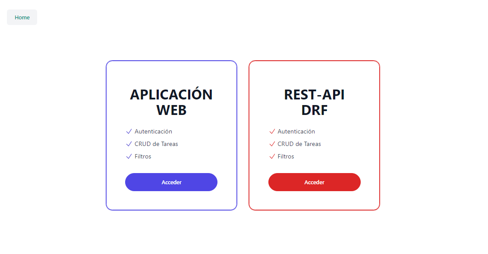
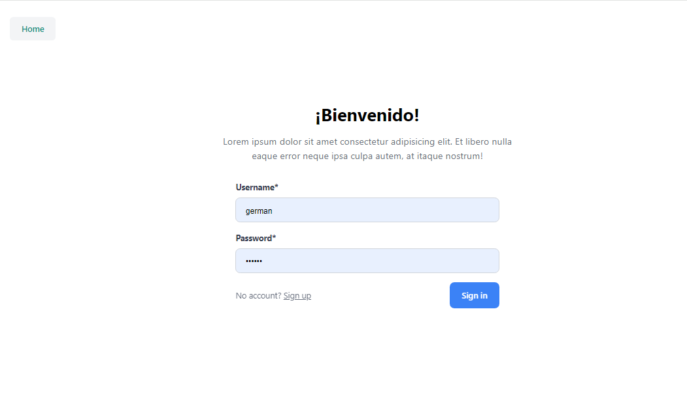
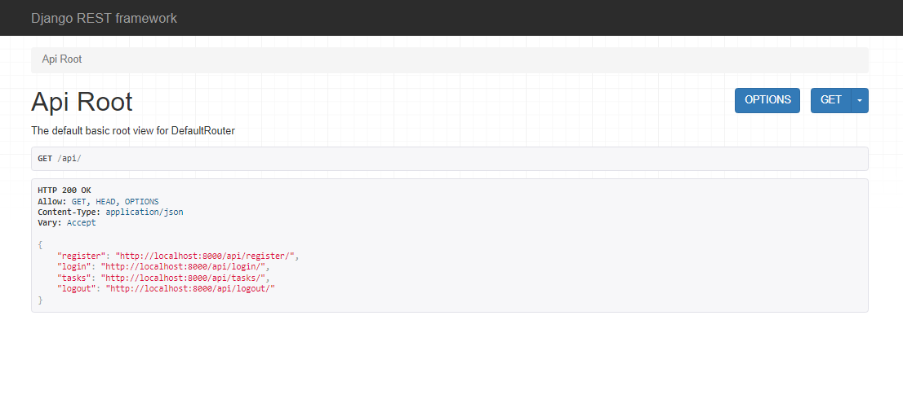
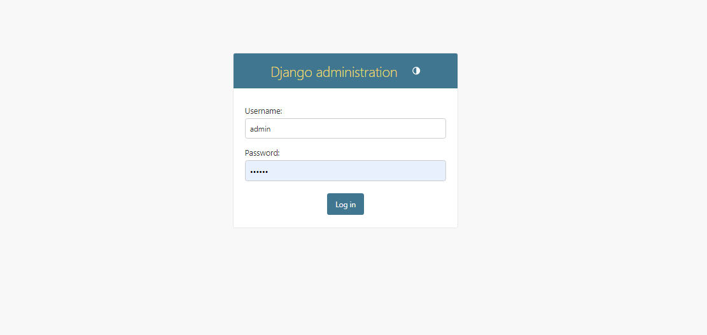

# **INVERA: ToDo-List Challenge**
## 👁 Información
**Contacto:** Germán Salina  
**Email:** gersalina28@gmail.com  
**Tel:** +54 9 0343 154 599358  
**Cel:** +54 9 3434599358  
**LinkedIn:** [Bioingeniero Germán Salina](https://www.linkedin.com/in/ingeniero-salina-german/)  
**Página Web:** [Blog Personal](https://www.notion.so/775f8b5f910841a19ea81c4dbac66aec?pvs=21)
<br>

## 🗝️ Requisitos
<details><summary>Conocimientos previos</summary>
  
  - Terminal y Línea de Comandos
  - [Python 3](https://www.python.org/)
  - Django
  - Bases de Datos
  - Docker
  - Testing
  - Django Rest Framework (DRF)

</details>
<details><summary>Herramientas necesarias</summary>
  
  - Computadora con sistema operativo Windows, MacOS o Linux.
  - [Visual Studio Code](https://code.visualstudio.com/)
  - Docker
  - Postman o Thunder Client
</details>
<br>

## 🎯 Objetivos
<details><summary>Objetivos del proyecto</summary>
  
  - Autenticarse
  - Crear una tarea
  - Eliminar una tarea
  - Marcar tareas como completadas
  - Poder ver una lista de todas las tareas existentes
  - Filtrar/buscar tareas por fecha de creación y/o por el contenido de la misma
</details>
<br>

## 📜 Resumen
<details>  <summary>Descripción del Challenge</summary>
  
  **Qué queremos que hagas:**

  - El Challenge consiste en crear una aplicación web sencilla que permita a los usuarios crear y mantener una lista de tareas.
  - La entrega del resultado será en un nuevo fork de este repo y deberás hacer una pequeña demo del funcionamiento y desarrollo del proyecto ante un comité técnico.
  - Podes contactarnos en caso que tengas alguna consulta.

  **Qué evaluamos:**

  - Desarrollo utilizando Python, Django. No es necesario crear un Front-End, pero sí es necesario tener una API que permita cumplir con los objetivos de arriba.
  - Uso de librerías y paquetes estándar que reduzcan la cantidad de código propio añadido.
  - Calidad y arquitectura de código.
  - [Bonus] Manejo de logs.
  - [Bonus] Creación de tests (unitarias y de integración)
  - [Bonus] Unificar la solución propuesta en una imagen de Docker para que pueda ser ejecutada en cualquier ambiente.  
</details>
<br>

# Manual de Usuario con imágenes
[Manual de Usuario ilustrado](https://www.notion.so/german-salina/INVERA-ToDo-List-Challenge-8a60e476d55940c3b360e06d5da3018c)

# Guía de Instalación
<details><summary>Clonar la Aplicación y ubicarse en el directorio del proyecto</summary>

  ```bash
  git clone https://github.com/Gersa28/Invera-ToDo-List.git .
  ```
</details>
<details><summary>Instalación mediante Entorno Virtual</summary>

  ### Windows

  ```bash
  python --version
  pip install virtualenv
  python -m venv venv
  .\venv\Scripts\Activate
  pip list
  python.exe -m pip install --upgrade pip
  pip install -r requirements.txt
  python manage.py createsuperuser
  python manage.py makemigrations
  python manage.py migrate
  python manage.py runserver
  ```

  ### Linux

  ```bash
  python3 --version
  pip3 install virtualenv
  python3 -m venv venv
  source venv/bin/activate
  pip list
  python3 -m pip install --upgrade pip
  pip install -r requirements.txt
  python3 manage.py createsuperuser
  python3 manage.py makemigrations
  python3 manage.py migrate
  python3 manage.py runserver
  ```
</details>
<details><summary>Instalación utilizando Docker</summary>

  ```bash
  # Verificar la versión de Docker instalada
  docker --version

  # Crear la imagen llamada "proyectotodo" usando el Dockerfile actual
  sudo docker build -t proyectotodo .

  # Ejecutar el contenedor mapeando el puerto 8000 del contenedor al puerto 8000 del host
  docker run -d -p 8000:8000 --name proyectotodo proyectotodo

  # Listar los contenedores activos para verificar el nombre correspondiente
  docker ps

  # Acceder al contenedor en ejecución usando el nombre o ID del contenedor
  docker exec -it proyectotodo /bin/bash

  # Crear un superusuario para la aplicación de Django dentro del contenedor
  python manage.py createsuperuser

  # Salir del bash
  exit

  # Detener el contenedor en ejecución de forma ordenada
  docker stop proyectotodo
  ```
</details>
<details><summary>Acceso</summary>
  http://127.0.0.1:8000/
</details>
<br>

# Aplicación WEB
<details><summary>Versión Gráfica</summary>  

  
  
  

</details>

<details><summary>Consola de Administración de Django</summary>  
  
  http://127.0.0.1:8000/admin/

  

</details>
<br>

# Peticiones a la API
<details>  <summary>Documentación de la API</summary>
  
  http://127.0.0.1:8000/api/docs/

<br>

</details>

<details><summary>API ROOT</summary>  
  💡Para los ejemplos se utiliza la extensión Thunder Client para VSCode. También se puede utilizar la interfaz por defecto de Django Rest Framework.
  
  <br><br>
  Cliente:  [Thunder Client Extension](https://marketplace.visualstudio.com/items?itemName=rangav.vscode-thunder-client)
  <br><br>
  Acceso: http://127.0.0.1:8000/api/
  <br>
  
  - ENDPOINTS

  ```
  {
    "register": "http://192.168.0.17:8000/api/register/",
    "login": "http://192.168.0.17:8000/api/login/",
    "tasks": "http://192.168.0.17:8000/api/tasks/",
    "logout": "http://192.168.0.17:8000/api/logout/"
  }
  ```
  <br>

</details>

<details><summary>REGISTRO DE USUARIO</summary>  

  <details><summary>GET: Listar Usuarios</summary>   
  http://127.0.0.1:8000/api/register/

  </details>

  <details><summary>POST: Registrar Usuario</summary> 
  http://127.0.0.1:8000/api/register/

  ```
  {
    "username": "nuevo_usuario_1",
    "password": "password123456@",
    "password2": "password123456@"
  }
  ```

  </details>

  <br>

</details>

<details><summary>LOGIN</summary>
  http://127.0.0.1:8000/api/login/

  - POST

  ```
  {
    "username": "nuevo_usuario_1",
    "password": "password123456@"
  }
  ```
  <br>

</details>

<details><summary>CRUD DE TAREAS</summary>
  <details><summary>POST: Crear Tareas</summary>
  💡 La creación de una tarea requiere de una autenticación básica (username y contraseña en la sección Auth).
    
    http://127.0.0.1:8000/api/tasks/
    
  - Creación de Tarea

  ```
  {
    "name": "Nueva tarea",
    "description": "Descripción de la nueva tarea",
    "status": "not_started"
  }
  ```
  </details>

  <details><summary>GET: Listar Tareas</summary>

  💡 Listar tareas requiere de una autenticación básica (username y contraseña en la sección Auth). 

    http://127.0.0.1:8000/api/tasks/

  </details>
  <details><summary>PUT/PATCH: Actualizar completamente/parcialmente</summary>

  💡 Actualizar tareas también requiere de una autenticación básica (username y contraseña en la sección Auth). 
  Además, se debe indicar el id de la tarea a ser actualizada.  
    **VERIFICAR EL ID CORRECTO DE LA TAREA A ACTUALIZAR (”28 en el ejemplo”)**  

    http://127.0.0.1:8000/api/tasks/28/

  ```
  {  
    "name": "Nueva tarea 1 ACTUALIZADA", 
    "description": "Descripción de la nueva tarea ACTUALIZADA"
    "status": "in_progress" 
  }
  ```

    
  </details>
  <details><summary>DELETE</summary>

  💡 Eliminar tareas requiere de una autenticación básica (username y contraseña en la sección Auth).
  Además, se debe indicar el id de la tarea a ser eliminada.  
    **VERIFICAR EL ID CORRECTO DE LA TAREA A ELIMINAR (”28 en el ejemplo”)**  

    http://127.0.0.1:8000/api/tasks/28/

    
  </details>

  <br>

</details>

<details><summary>GET: Buscar/Filtrar Tareas</summary>  

  <details><summary>Por Contenido</summary>

  💡 Filtrar tareas requiere de una autenticación básica (username y contraseña en la sección Auth).  
    http://127.0.0.1:8000/api/tasks/?q=JUEVES

  </details>

  <details><summary>Por Fecha</summary>

  💡 Filtrar tareas requiere de una autenticación básica (username y contraseña en la sección Auth).  
    http://127.0.0.1:8000/api/tasks/?date_from=2024-09-01&date_to=2024-09-30

  </details>

  <details><summary>Por Contenido y Fecha</summary>

  💡 Filtrar tareas requiere de una autenticación básica (username y contraseña en la sección Auth).  
    http://127.0.0.1:8000/api/tasks/?q=Responsabilidad&date_from=2024-09-01&date_to=2024-09-30

  </details>

  <br>

</details>

<details><summary>LOGOUT</summary>

  💡 LogOut requiere de una autenticación básica (username y contraseña en la sección Auth).
    http://127.0.0.1:8000/api/logout/
  
  <br>

</details>

# Testing

<details>
  <summary>Ejecutar Tests</summary>

  Para correr los tests ejecuta:

  ```bash
  python manage.py test
  ```
</details>


<br>

# Manejo de Logs

<details>
  <summary>Logs de la Aplicación</summary>
  En este ejemplo se guardarán los logs en un archivo llamado django_debug.log.

- Los logs de la consola se verán de forma más simple.
- Se ha configurado un logger específico para la aplicación `app_tasks` y la `api`, además del logger global de Django.
  Ejemplo de un log en el archivo:

  ```
  INFO 2024-09-13 15:45:30 views Tarea creada por testuser
  INFO 2024-09-13 15:46:12 api Listando tareas para el usuario: testuser
  ```

</details>
